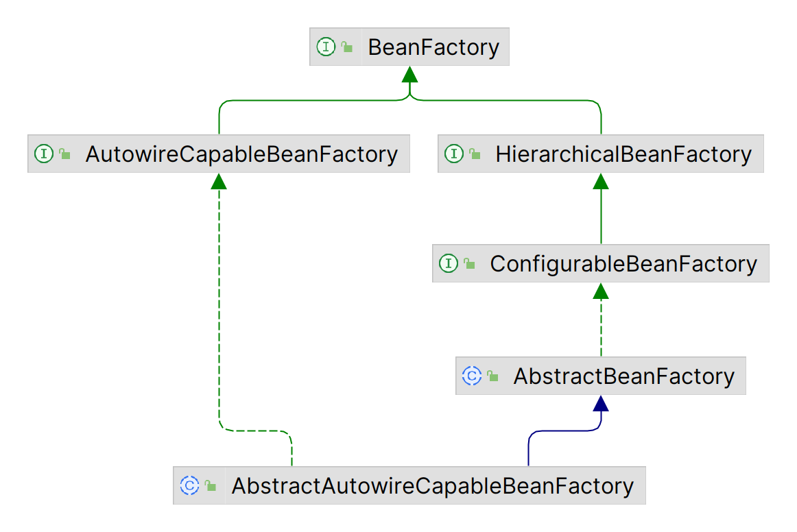
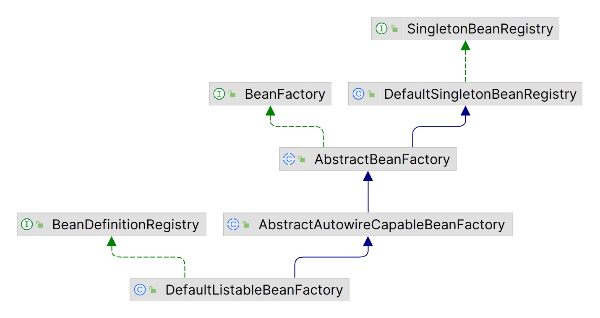

# 基础篇：IOC
## 1、bean 简单容器 
定义一个简单的 bean 容器 BeanFactory，内部包含获取bean方法。
```java
public interface BeanFactory {

    /**
     * 获取bean
     */
    Object getBean(String name) throws BeansException;

}
```


- BeanFactory 作为容器的顶级接口，定义了获取 bean 的接口，在其实现类 AbstractBeanFactory、AbstractAutowireCapableBeanFactory 对该方法做了具体实现。
- AbstractBeanFactory 中定义了 Map 作为 bean 的容器。
- `AbstractBeanFactory#getBean` 定义了获取 bean 的逻辑（从容器中获取单例 bean 实例，还是创建 bean 实例，如果是FactoryBean，从 FactoryBean#getObject 中创建bean）。
- `AbstractBeanFactory#getBean` 该方法使用模板方法设计模式，createBean方法并未实现，留给子类去实现。
- `AbstractAutowireCapableBeanFactory#createBean` 创建 bean 。



## 2、BeanDefinition 和 BeanDefinitionRegistry
主要添加以下类：

- BeanDefinition，顾名思义，用于定义 bean 信息的类，包含 bean 的 class 类型、构造参数、属性值等信息，每个 bean 对应一个 BeanDefinition 的实例。简化 BeanDefinition 仅包含 bean 的 class 类型。
- BeanDefinitionRegistry，BeanDefinition 注册表接口，定义注册 BeanDefinition 的方法。
- SingletonBeanRegistry 及其实现类 DefaultSingletonBeanRegistry，定义添加和获取单例 bean 的方法。

bean容器作为BeanDefinitionRegistry和SingletonBeanRegistry的实现类，具备两者的能力。向bean容器中注册BeanDefinition后，使用bean时才会实例化。


测试：
```java
public class BeanDefinitionAndBeanDefinitionRegistryTest {

    @DisplayName("测试 BeanDefinitionAnd 和 DefinitionRegistry")
    @Test
    public void testBeanFactory() {
        DefaultListableBeanFactory beanFactory = new DefaultListableBeanFactory();
        BeanDefinition beanDefinition = new BeanDefinition(HelloService.class);

        beanFactory.registerBeanDefinition("helloService", beanDefinition);
        HelloService helloService =  (HelloService)beanFactory.getBean("helloService");
        helloService.hello();
    }
}

public class HelloService {
    public void hello() {
        System.out.printf("hello spring");
    }
}
```
## 3、InstantiationStrategy -- bean 的实例化策略
现在 bean 是在 AbstractAutowireCapableBeanFactory.doCreateBean 方法中用beanClass.newInstance() 来实例化，仅适用于bean有无参构造函数的情况。

针对 bean 的实例化，抽象出一个实例化策略的接口 InstantiationStrategy，有两个实现类：

- SimpleInstantiationStrategy，使用bean的构造函数来实例化
- CglibSubclassingInstantiationStrategy，使用CGLIB动态生成子类

bean 实例化：
```java
    /**
     * 根据配置的实例化策略实例化bean
     *
     * @param beanDefinition
     * @return
     */
    protected Object createBeanInstance(BeanDefinition beanDefinition) {
        return getInstantiationStrategy().instantiate(beanDefinition);
    }
```
## 4、bean 属性注入

- 在BeanDefinition中增加和bean属性对应的PropertyValues，实例化bean之后，为bean填充属性(AbstractAutowireCapableBeanFactory#applyPropertyValues)。
- 增加类 PropertyValues、PropertyValue 

测试：
```java
public class PopulateBeanWithPropertyValuesTest {

    @DisplayName("bean属性注入")
    @Test
    public void testPopulateBeanWithPropertyValues() {
        DefaultListableBeanFactory beanFactory = new DefaultListableBeanFactory();
        PropertyValues propertyValues = new PropertyValues();
        propertyValues.addPropertyValue(new PropertyValue("name","jack"));
        propertyValues.addPropertyValue(new PropertyValue("age",18));
        BeanDefinition beanDefinition = new BeanDefinition(Student.class, propertyValues);

        beanFactory.registerBeanDefinition("student", beanDefinition);
        Student student = (Student) beanFactory.getBean("student");
        System.out.println("student: " + student);
        Assertions.assertEquals("jack", student.getName());
        Assertions.assertEquals(18, student.getAge());
    }
}
```
## 5、引用类型注入
增加 BeanReference 类，包装一个 bean 对另一个 bean 的引用。实例化 beanA 后填充属性时，若 PropertyValue#value为BeanReference，引用 beanB，则先去实例化 beanB。 由于不想增加代码的复杂度提高理解难度，暂时不支持循环依赖，后面会在高级篇中解决该问题。
AbstractAutowireCapableBeanFactory#applyPropertyValues ：
```java
protected void applyPropertyValues(String beanName, Object bean, BeanDefinition beanDefinition) {
    try {
        for (PropertyValue propertyValue : beanDefinition.getPropertyValues().getPropertyValues()) {
            String name = propertyValue.getName();
            Object value = propertyValue.getValue();
            if (value instanceof BeanReference) {
                // beanA依赖beanB，先实例化beanB
                BeanReference beanReference = (BeanReference) value;
                value = getBean(beanReference.getBeanName());
            }

            //通过反射设置属性
            BeanUtil.setFieldValue(bean, name, value);
        }
    } catch (Exception ex) {
        throw new BeansException("Error setting property values for bean: " + beanName, ex);
    }
}
```
测试：
```java
public class PopulateBeanWithPropertyValuesTest {

    @DisplayName("为bean注入bean")
    @Test
    public void testPopulateBeanWithBean() {
        DefaultListableBeanFactory beanFactory = new DefaultListableBeanFactory();

        //注册book实例
        PropertyValues propertyValuesForBook = new PropertyValues();
        propertyValuesForBook.addPropertyValue(new PropertyValue("name", "鲁滨逊漂流记"));
        propertyValuesForBook.addPropertyValue(new PropertyValue("tag", "文学"));
        BeanDefinition bookBeanDefinition = new BeanDefinition(Book.class, propertyValuesForBook);
        beanFactory.registerBeanDefinition("book", bookBeanDefinition);

        //注册Student实例
        PropertyValues propertyValuesForStudent = new PropertyValues();
        propertyValuesForStudent.addPropertyValue(new PropertyValue("name", "jim"));
        propertyValuesForStudent.addPropertyValue(new PropertyValue("age", 18));
        //Student实例依赖book实例
        propertyValuesForStudent.addPropertyValue(new PropertyValue("book", new BeanReference("book")));
        BeanDefinition beanDefinition = new BeanDefinition(Student.class, propertyValuesForStudent);
        beanFactory.registerBeanDefinition("student", beanDefinition);

        Student student = (Student) beanFactory.getBean("student");
        System.out.println(student);
        Assertions.assertEquals(student.getName(),"jim");
        Assertions.assertEquals(student.getAge(),18);
        Book book = student.getBook();
        Assertions.assertNotNull(book);
        Assertions.assertEquals(book.getName(), "鲁滨逊漂流记");
    }
}
```

## 6、资源和资源加载器
Resource是资源的抽象和访问接口


- FileSystemResource，文件系统资源的实现类
- ClassPathResource，classpath下资源的实现类
- UrlResource，对java.net.URL进行资源定位的实现类

ResourceLoader接口则是资源查找定位策略的抽象，DefaultResourceLoader是其默认实现类
测试：
```java
public class ResourceAndResourceLoaderTest {

    @DisplayName("资源加载")
    @Test
    public void testResourceLoader() throws Exception {
        DefaultResourceLoader resourceLoader = new DefaultResourceLoader();

        //加载classpath下的资源
        Resource resource = resourceLoader.getResource("classpath:hello.txt");
        InputStream inputStream = resource.getInputStream();
        String content = IoUtil.readUtf8(inputStream);
        System.out.println(content);
        Assertions.assertEquals(content, "hello world");

        //加载文件系统资源
        resource = resourceLoader.getResource("src/test/resources/hello.txt");
        Assertions.assertTrue(resource instanceof FileSystemResource);
        inputStream = resource.getInputStream();
        content = IoUtil.readUtf8(inputStream);
        System.out.println(content);
        Assertions.assertEquals(content, "hello world");

        //加载url资源
        resource = resourceLoader.getResource("https://www.baidu.com");
        Assertions.assertTrue(resource instanceof UrlResource);
        inputStream = resource.getInputStream();
        content = IoUtil.readUtf8(inputStream);
        System.out.println(content);
    }
}

```
## 7、BeanDefinitionReader 解析xml文件
有了资源加载器，就可以在xml格式配置文件中声明式地定义bean的信息，资源加载器读取xml文件，解析出bean的信息，然后往容器中注册BeanDefinition。

- BeanDefinitionReader是读取bean定义信息的抽象接口。
- XmlBeanDefinitionReader是从xml文件中读取的实现类。
- BeanDefinitionReader需要有获取资源的能力，且读取bean定义信息后需要往容器中注册BeanDefinition，因此BeanDefinitionReader的抽象实现类AbstractBeanDefinitionReader拥有ResourceLoader和BeanDefinitionRegistry两个属性。


测试： hello.xml
```java
<?xml version="1.0" encoding="UTF-8"?>
<beans xmlns="http://www.springframework.org/schema/beans"
       xmlns:xsi="http://www.w3.org/2001/XMLSchema-instance"
       xmlns:context="http://www.springframework.org/schema/context"
       xsi:schemaLocation="http://www.springframework.org/schema/beans
	         http://www.springframework.org/schema/beans/spring-beans.xsd
		 http://www.springframework.org/schema/context
		 http://www.springframework.org/schema/context/spring-context-4.0.xsd">


    <bean id="book" class="org.springframework.bean.Book">
        <property name="name" value="西游记"/>
        <property name="tag" value="神话"/>
    </bean>

    <bean id="student" class="org.springframework.bean.Student">
        <property name="name" value="tom"/>
        <property name="age" value="18"/>
        <property name="book" ref="book"/>
    </bean>

</beans>
```

```java
public class XmlFileDefineBeanTest {


    @DisplayName("测试beanDefinitionReader")
    @Test
    public void testXmlFile() {

        DefaultListableBeanFactory beanFactory = new DefaultListableBeanFactory();
        XmlBeanDefinitionReader beanDefinitionReader = new XmlBeanDefinitionReader(beanFactory);
        beanDefinitionReader.loadBeanDefinitions("classpath:hello.xml");

        Student student = (Student) beanFactory.getBean("student");
        System.out.println(student);
        Assertions.assertEquals(student.getName(), "tom");
        Assertions.assertEquals(student.getBook().getName(),"西游记");

        Book book = (Book) beanFactory.getBean("book");
        System.out.println(book);
        Assertions.assertEquals(book.getName(), "西游记");
    }
}
```
## 8、BeanFactoryPostProcessor和BeanPostProcessor
BeanFactoryPostProcessor和BeanPostProcessor是spring框架中具有重量级地位的两个接口，理解了这两个接口的作用，基本就理解spring的核心原理了。

BeanFactoryPostProcessor是spring提供的容器扩展机制，允许我们在bean实例化之前修改bean的定义信息即BeanDefinition的信息。其重要的实现类有PropertyPlaceholderConfigurer和CustomEditorConfigurer，PropertyPlaceholderConfigurer的作用是用properties文件的配置值替换xml文件中的占位符，CustomEditorConfigurer的作用是实现类型转换。BeanFactoryPostProcessor的实现比较简单，看单元测试BeanFactoryPostProcessorAndBeanPostProcessorTest#testBeanFactoryPostProcessor追下代码。

BeanPostProcessor也是spring提供的容器扩展机制，不同于BeanFactoryPostProcessor的是，BeanPostProcessor在bean实例化后修改bean或替换bean。BeanPostProcessor是后面实现AOP的关键。

BeanPostProcessor的两个方法分别在bean执行初始化方法（后面实现）之前和之后执行，理解其实现重点看单元测试BeanFactoryPostProcessorAndBeanPostProcessorTest#testBeanPostProcessor和AbstractAutowireCapableBeanFactory#initializeBean方法，有些地方做了微调，可不必关注。
```java
public interface BeanPostProcessor {
	/**
	 * 在bean执行初始化方法之前执行此方法
	 */
	Object postProcessBeforeInitialization(Object bean, String beanName) throws BeansException;

	/**
	 * 在bean执行初始化方法之后执行此方法
	 */
	Object postProcessAfterInitialization(Object bean, String beanName) throws BeansException;
}
```
下一节将引入ApplicationContext，能自动识别BeanFactoryPostProcessor和BeanPostProcessor，就可以在xml文件中配置而不需要手动添加到BeanFactory了。
测试：
```java
public class CustomBeanFactoryPostProcessor implements BeanFactoryPostProcessor {
    @Override
    public void postProcessBeanFactory(ConfigurableListableBeanFactory beanFactory) throws BeansException {
        System.out.println("自定义BeanFactoryPostProcessor");
        BeanDefinition student = beanFactory.getBeanDefinition("student");
        PropertyValues studentPropertyValues = student.getPropertyValues();
        //修改student的name
        studentPropertyValues.addPropertyValue(new PropertyValue("name", "curry"));
    }
}
```
```java
public class CustomerBeanPostProcessor implements BeanPostProcessor {
    @Override
    public Object postProcessBeforeInitialization(Object bean, String beanName) throws BeansException {
        System.out.println("自定义beanPostProcessor前置方法，beanName: " + beanName);
        if ("book".equals(beanName)) {
            ((Book) bean).setName("红楼梦");
        }
        return bean;
    }

    @Override
    public Object postProcessAfterInitialization(Object bean, String beanName) throws BeansException {
        System.out.println("自定义beanPostProcessor后置方法，beanName: " + beanName);
        return null;
    }
}
```
```java
public class BeanFactoryProcessorAndBeanPostProcessorTest {


    @DisplayName("测试BeanPostFactoryPostProcessor")
    @Test
    public void testBeanPostFactoryPostProcessor() {
        DefaultListableBeanFactory beanFactory = new DefaultListableBeanFactory();
        XmlBeanDefinitionReader beanDefinitionReader = new XmlBeanDefinitionReader(beanFactory);
        beanDefinitionReader.loadBeanDefinitions("classpath:hello.xml");

        //beanDefinition 加载完成之后， bean 实例化之前， 修改 beanDefinition 的属性值
        CustomBeanFactoryPostProcessor customBeanFactoryPostProcessor = new CustomBeanFactoryPostProcessor();
        customBeanFactoryPostProcessor.postProcessBeanFactory(beanFactory);

        Student student = (Student) beanFactory.getBean("student");
        System.out.println(student);
        Assertions.assertEquals("curry", student.getName());
    }

    @DisplayName("测试beanPostProcessor")
    @Test
    public void testBeanPostProcessor() {
        DefaultListableBeanFactory beanFactory = new DefaultListableBeanFactory();
        XmlBeanDefinitionReader beanDefinitionReader = new XmlBeanDefinitionReader(beanFactory);
        beanDefinitionReader.loadBeanDefinitions("classpath:hello.xml");

        CustomerBeanPostProcessor beanPostProcessor = new CustomerBeanPostProcessor();
        beanFactory.addBeanPostProcessor(beanPostProcessor);

        Book book = (Book) beanFactory.getBean("book");
        System.out.println(book);
        Assertions.assertEquals("红楼梦", book.getName());
    }
}
```


## 9、高级容器 applicationContext

- 应用上下文ApplicationContext是spring中较之于BeanFactory更为先进的IOC容器，ApplicationContext除了拥有BeanFactory的所有功能外，还支持特殊类型bean如上一节中的BeanFactoryPostProcessor和BeanPostProcessor的自动识别、资源加载、容器事件和监听器、国际化支持、单例bean自动初始化等。
- BeanFactory是spring的基础设施，面向spring本身；而ApplicationContext面向spring的使用者，应用场合使用ApplicationContext。
- 具体实现查看AbstractApplicationContext#refresh方法即可。注意BeanFactoryPostProcessor和BeanPostProcessor的自动识别（AbstractApplicationContext#refresh 和 AbstractAutowireCapableBeanFactory#initializeBean），这样就可以在xml文件中配置二者而不需要像上一节一样手动添加到容器中了。


从bean的角度看，目前生命周期如下：

测试：hello.xml
```java
<?xml version="1.0" encoding="UTF-8"?>
<beans xmlns="http://www.springframework.org/schema/beans"
       xmlns:xsi="http://www.w3.org/2001/XMLSchema-instance"
       xmlns:context="http://www.springframework.org/schema/context"
       xsi:schemaLocation="http://www.springframework.org/schema/beans
	         http://www.springframework.org/schema/beans/spring-beans.xsd
		 http://www.springframework.org/schema/context
		 http://www.springframework.org/schema/context/spring-context-4.0.xsd">


    <bean id="book" class="org.springframework.bean.Book">
        <property name="name" value="西游记"/>
        <property name="tag" value="神话"/>
    </bean>

    <bean id="student" class="org.springframework.bean.Student">
        <property name="name" value="tom"/>
        <property name="age" value="18"/>
        <property name="book" ref="book"/>
    </bean>

    <bean class="org.springframework.common.CustomBeanFactoryPostProcessor"/>

    <bean class="org.springframework.common.CustomerBeanPostProcessor"/>
</beans>
```
```java
public class ApplicationContextTest {

    @DisplayName("测试ApplicationContext")
    @Test
    public void testApplicationContext() {

        ClassPathXmlApplicationContext applicationContext = new ClassPathXmlApplicationContext("classpath:hello.xml");
        Student student = (Student) applicationContext.getBean("student");
        System.out.println(student);
        //student的name在CustomBeanFactoryPostProcessor中被修改成 curry
        Assertions.assertEquals(student.getName(), "curry");

        Book book = (Book) applicationContext.getBean("book");
        System.out.println(book);
        //book的name在CustomerBeanPostProcessor中被修改成红楼梦
        Assertions.assertEquals(book.getName(), "红楼梦");
    }
}
```

## 10、bean的初始化和销毁方法
在spring中，定义bean的初始化和销毁方法有三种方法：

- 在xml文件中制定init-method和destroy-method
- 继承自InitializingBean和DisposableBean
- 在方法上加注解PostConstruct和PreDestroy

第三种通过BeanPostProcessor实现，在扩展篇中实现，本节只实现前两种。
针对第一种在xml文件中指定初始化和销毁方法的方式，在BeanDefinition中增加属性initMethodName和destroyMethodName。

初始化方法在AbstractAutowireCapableBeanFactory#invokeInitMethods执行。DefaultSingletonBeanRegistry中增加属性disposableBeans保存拥有销毁方法的bean，拥有销毁方法的bean在AbstractAutowireCapableBeanFactory#registerDisposableBeanIfNecessary中注册到disposableBeans中。

为了确保销毁方法在虚拟机关闭之前执行，向虚拟机中注册一个钩子方法，查看AbstractApplicationContext#registerShutdownHook（非web应用需要手动调用该方法）。当然也可以手动调用ApplicationContext#close方法关闭容器。
到此为止，bean的生命周期如下：

测试： init-and-destroy-method.xml
```java
<?xml version="1.0" encoding="UTF-8"?>
<beans xmlns="http://www.springframework.org/schema/beans"
       xmlns:xsi="http://www.w3.org/2001/XMLSchema-instance"
       xmlns:context="http://www.springframework.org/schema/context"
       xsi:schemaLocation="http://www.springframework.org/schema/beans
	         http://www.springframework.org/schema/beans/spring-beans.xsd
		 http://www.springframework.org/schema/context
		 http://www.springframework.org/schema/context/spring-context-4.0.xsd">

    <bean id="student" class="org.springframework.bean.Student" init-method="customInitMethod" destroy-method="customDestroyMethod">
        <property name="name" value="james"/>
        <property name="book" ref="book"/>
    </bean>

    <bean id="book" class="org.springframework.bean.Book">
        <property name="name" value="水浒传"/>
    </bean>
</beans>
```
```java
public class Student implements InitializingBean, DisposableBean {

    private String name;

    private int age;

    private Book book;

    public void customInitMethod() {
        System.out.println("自定义初始化方法1：xml init-method 配置的 customInitMethod方法");
    }

    public void customDestroyMethod() {
        System.out.println("自定义销毁方法1：xml destroy-method 配置的 customDestroyMethod方法");
    }

    @Override
    public void destroy() throws Exception {
        System.out.println("自定义销毁方法2：通过 InitializingBean#destroy 销毁");
    }

    @Override
    public void afterPropertiesSet() throws Exception {
        System.out.println("自定义初始化方法2：通过 InitializingBean#afterPropertiesSet 初始化");
    }
}
```
```java
public class InitAndDestroyMethodTest {

    @DisplayName("测试初始化和销毁方法")
    @Test
    public void testInitAndDestroy() {

        ClassPathXmlApplicationContext applicationContext = new ClassPathXmlApplicationContext("classpath:init-and-destroy-method.xml");
        applicationContext.registerShutdownHook();
    }
}
```
## 11、Aware接口

- Aware是感知、意识的意思，Aware接口是标记性接口，其实现子类能感知容器相关的对象。常用的Aware接口有BeanFactoryAware和ApplicationContextAware，分别能让其实现者感知所属的BeanFactory和ApplicationContext。
- 让实现BeanFactoryAware接口的类能感知所属的BeanFactory，实现比较简单，查看AbstractAutowireCapableBeanFactory#initializeBean前三行。
- 实现ApplicationContextAware的接口感知ApplicationContext，是通过BeanPostProcessor。由bean的生命周期可知，bean实例化后会经过BeanPostProcessor的前置处理和后置处理。定义一个BeanPostProcessor的实现类ApplicationContextAwareProcessor，在AbstractApplicationContext#refresh方法中加入到BeanFactory中，在前置处理中为bean设置所属的ApplicationContext。

至止，bean的生命周期如下：

测试：hello.xml
```java
<?xml version="1.0" encoding="UTF-8"?>
<beans xmlns="http://www.springframework.org/schema/beans"
       xmlns:xsi="http://www.w3.org/2001/XMLSchema-instance"
       xmlns:context="http://www.springframework.org/schema/context"
       xsi:schemaLocation="http://www.springframework.org/schema/beans
	         http://www.springframework.org/schema/beans/spring-beans.xsd
		 http://www.springframework.org/schema/context
		 http://www.springframework.org/schema/context/spring-context-4.0.xsd">

    <bean class="org.springframework.service.HelloService"/>
</beans>
```
```java
public class HelloService implements BeanFactoryAware, ApplicationContextAware {

    private ApplicationContext applicationContext;

    private BeanFactory beanFactory;

    @Override
    public void setBeanFactory(BeanFactory beanFactory) throws BeansException {
        this.beanFactory = beanFactory;
    }

    @Override
    public void setApplicationContext(ApplicationContext applicationContext) throws BeansException {
        this.applicationContext = applicationContext;
    }

    public ApplicationContext getApplicationContext() {
        return applicationContext;
    }

    public BeanFactory getBeanFactory() {
        return beanFactory;
    }
}
```
```java
public class AwareInterfaceTest {

    @DisplayName("测试aware接口")
    @Test
    public void testAware() {

        ClassPathXmlApplicationContext applicationContext = new ClassPathXmlApplicationContext("classpath:hello.xml");
        HelloService helloService = applicationContext.getBean(HelloService.class);
        Assertions.assertNotNull(helloService.getApplicationContext());
        Assertions.assertNotNull(helloService.getBeanFactory());
    }
}
```
## 12、bean的作用域，增加prototype的支持
每次向容器获取prototype作用域bean时，容器都会创建一个新的实例。在BeanDefinition中增加描述bean的作用域的字段scope，创建prototype作用域bean时（AbstractAutowireCapableBeanFactory#doCreateBean），不往singletonObjects中增加该bean。prototype作用域bean不执行销毁方法，查看AbstractAutowireCapableBeanFactory#registerDisposableBeanIfNecessary方法。

至止，bean的生命周期如下：

测试： prototype-bean.xml
```java
<?xml version="1.0" encoding="UTF-8"?>
<beans xmlns="http://www.springframework.org/schema/beans"
       xmlns:xsi="http://www.w3.org/2001/XMLSchema-instance"
       xmlns:context="http://www.springframework.org/schema/context"
       xsi:schemaLocation="http://www.springframework.org/schema/beans
	         http://www.springframework.org/schema/beans/spring-beans.xsd
		 http://www.springframework.org/schema/context
		 http://www.springframework.org/schema/context/spring-context-4.0.xsd">

    <bean id="book" class="org.springframework.bean.Book" scope="prototype">
        <property name="name" value="水浒传"/>
    </bean>
</beans>
```
```java
public class PrototypeBeanTest {

    @DisplayName("测试prototypeBean")
    @Test
    public void testPrototypeBean() {

        ClassPathXmlApplicationContext applicationContext = new ClassPathXmlApplicationContext("classpath:prototype-bean.xml");
        Object book1 = applicationContext.getBean("book");
        Object book2 = applicationContext.getBean("book");
        System.out.println(book2 == book1);
        Assertions.assertNotSame(book1, book2);
    }
}
```
## 13、FactoryBean

- FactoryBean是一种特殊的bean，当向容器获取该bean时，容器不是返回其本身，而是返回其FactoryBean#getObject方法的返回值，可通过编码方式定义复杂的bean。
- 实现逻辑比较简单，当容器发现bean为FactoryBean类型时，调用其getObject方法返回最终bean。当FactoryBean#isSingleton==true，将最终bean放进缓存中，下次从缓存中获取。见AbstractBeanFactory#getBean。

测试： factory-bean.xml
```java
<?xml version="1.0" encoding="UTF-8"?>
<beans xmlns="http://www.springframework.org/schema/beans"
       xmlns:xsi="http://www.w3.org/2001/XMLSchema-instance"
       xmlns:context="http://www.springframework.org/schema/context"
       xsi:schemaLocation="http://www.springframework.org/schema/beans
	         http://www.springframework.org/schema/beans/spring-beans.xsd
		 http://www.springframework.org/schema/context
		 http://www.springframework.org/schema/context/spring-context-4.0.xsd">

    <bean id="book" class="org.springframework.common.BookFactoryBean">
        <property name="name" value="钢铁是怎样炼成的"/>
    </bean>
</beans>
```
```java
public class BookFactoryBean implements FactoryBean<Book> {

    private String name;

    @Override
    public Book getObject() throws Exception {
        Book book = new Book();
        book.setName(name);
        return book;
    }

    @Override
    public boolean isSingleton() {
        return true;
    }

    public void setName(String name) {
        this.name = name;
    }
}
```
```java
public class FactoryBeanTest {

    @Test
    public void testFactoryBean() throws Exception {
        ClassPathXmlApplicationContext applicationContext = new ClassPathXmlApplicationContext("classpath:factory-bean.xml");

        Book book = applicationContext.getBean("book", Book.class);
        Assertions.assertEquals(book.getName(), "钢铁是怎样炼成的");
    }
}
```

## 13、事件与事件监听器
ApplicationContext容器提供了完善的事件发布和事件监听功。观察者设计模式。
ApplicationEventMulticaster接口是注册监听器和发布事件的抽象接口，AbstractApplicationContext包含其实现类实例作为其属性，使得ApplicationContext容器具有注册监听器和发布事件的能力。在AbstractApplicationContext#refresh方法中，会实例化ApplicationEventMulticaster、注册监听器并发布容器刷新事件ContextRefreshedEvent；在AbstractApplicationContext#doClose方法中，发布容器关闭事件ContextClosedEvent。

测试：event-and-event-listener.xml
```java
<?xml version="1.0" encoding="UTF-8"?>
<beans xmlns="http://www.springframework.org/schema/beans"
       xmlns:xsi="http://www.w3.org/2001/XMLSchema-instance"
       xmlns:context="http://www.springframework.org/schema/context"
       xsi:schemaLocation="http://www.springframework.org/schema/beans
	         http://www.springframework.org/schema/beans/spring-beans.xsd
		 http://www.springframework.org/schema/context
		 http://www.springframework.org/schema/context/spring-context-4.0.xsd">

    <bean class="org.springframework.common.event.ContextRefreshedEventListener"/>

    <bean class="org.springframework.common.event.CustomEventListener"/>

    <bean class="org.springframework.common.event.ContextClosedEventListener"/>
</beans>
```
```java
public class EventAndEventListenerTest {

	@Test
	public void testEventListener() throws Exception {
		ClassPathXmlApplicationContext applicationContext = new ClassPathXmlApplicationContext("classpath:event-and-event-listener.xml");
		applicationContext.publishEvent(new CustomEvent(applicationContext));
		applicationContext.registerShutdownHook();
	}
}
```

# 基础篇：AOP
## 1、切面表达式
Joinpoint，织入点，指需要执行代理操作的某个类的某个方法(仅支持方法级别的JoinPoint)；Pointcut是JoinPoint的表述方式，能捕获JoinPoint。
最常用的切点表达式是AspectJ的切点表达式。需要匹配类，定义ClassFilter接口；匹配方法，定义MethodMatcher接口。PointCut需要同时匹配类和方法，包含ClassFilter和MethodMatcher，AspectJExpressionPointcut是支持AspectJ切点表达式的PointCut实现，简单实现仅支持execution函数。
测试：
```java
public class PointcutExpressionService {

    public void doSomething() {
        System.out.println("PointcutExpressionService#doSomething 执行");
    }
}
```
```java
public class PointcutExpressionTest {

    @Test
    @DisplayName("切面表达式测试")
    public void testPointcutExpression() throws NoSuchMethodException {
        AspectJExpressionPointcut expressionPointcut =
                new AspectJExpressionPointcut("execution(* org.springframework.service.PointcutExpressionService.*(..))");

        Class<PointcutExpressionService> serviceClass = PointcutExpressionService.class;
        Method method = serviceClass.getDeclaredMethod("doSomething");

        Assertions.assertTrue(expressionPointcut.matches(serviceClass));
        Assertions.assertTrue(expressionPointcut.matches(method, serviceClass));
    }
}
```
## 2、基于JDK的动态代理
 
AopProxy是获取代理对象的抽象接口，JdkDynamicAopProxy的基于JDK动态代理的具体实现。TargetSource，被代理对象的封装。MethodInterceptor，方法拦截器，是AOP Alliance的"公民"，顾名思义，可以拦截方法，可在被代理执行的方法前后增加代理行为。

测试：
```java
public class DynamicProxyTest {

    private AdvisedSupport advisedSupport;

    @BeforeEach
    public void setup() {
        PersonService personService = new PersonServiceImpl();
        advisedSupport = new ProxyFactory();
        String expression = "execution(* org.springframework.service.PersonService.eat(..))";
        AspectJExpressionPointcutAdvisor advisor = new AspectJExpressionPointcutAdvisor();
        advisor.setExpression(expression);

        MethodBeforeAdviceInterceptor methodInterceptor = new MethodBeforeAdviceInterceptor(new PersonServiceBeforeAdvice());
        advisor.setAdvice(methodInterceptor);

        TargetSource targetSource = new TargetSource(personService);

        advisedSupport.setTargetSource(targetSource);
        advisedSupport.addAdvisor(advisor);
    }

    @Test
    public void testJdkDynamicProxy() throws Exception {
        PersonService proxy = (PersonService) new JdkDynamicAopProxy(advisedSupport).getProxy();
        proxy.eat();
    }

}
```

## 3、基于CJLIB的动态代理
基于CGLIB的动态代理实现逻辑也比较简单，查看CglibAopProxy。与基于JDK的动态代理在运行期间为接口生成对象的代理对象不同，基于CGLIB的动态代理能在运行期间动态构建字节码的class文件，为类生成子类，因此被代理类不需要继承自任何接口。
测试：
```java
public class DynamicProxyTest {

    private AdvisedSupport advisedSupport;

    @BeforeEach
    public void setup() {
        PersonService personService = new PersonServiceImpl();
        advisedSupport = new ProxyFactory();
        String expression = "execution(* org.springframework.service.PersonService.eat(..))";
        AspectJExpressionPointcutAdvisor advisor = new AspectJExpressionPointcutAdvisor();
        advisor.setExpression(expression);

        MethodBeforeAdviceInterceptor methodInterceptor = new MethodBeforeAdviceInterceptor(new PersonServiceBeforeAdvice());
        advisor.setAdvice(methodInterceptor);

        TargetSource targetSource = new TargetSource(personService);

        advisedSupport.setTargetSource(targetSource);
        advisedSupport.addAdvisor(advisor);
    }

    @Test
    public void testCglibDynamicProxy() throws Exception {
        PersonService proxy = (PersonService) new CglibAopProxy(advisedSupport).getProxy();
        proxy.eat();
    }
}
```
## 4、AOP代理工厂

增加AOP代理工厂ProxyFactory，由AdvisedSupport#proxyTargetClass属性决定使用JDK动态代理还是CGLIB动态代理。
测试：
```java
public class DynamicProxyTest {

    private AdvisedSupport advisedSupport;

    @BeforeEach
    public void setup() {
        PersonService personService = new PersonServiceImpl();
        advisedSupport = new ProxyFactory();
        String expression = "execution(* org.springframework.service.PersonService.eat(..))";
        AspectJExpressionPointcutAdvisor advisor = new AspectJExpressionPointcutAdvisor();
        advisor.setExpression(expression);

        MethodBeforeAdviceInterceptor methodInterceptor = new MethodBeforeAdviceInterceptor(new PersonServiceBeforeAdvice());
        advisor.setAdvice(methodInterceptor);

        TargetSource targetSource = new TargetSource(personService);

        advisedSupport.setTargetSource(targetSource);
        advisedSupport.addAdvisor(advisor);
    }

    @Test
    public void testProxyFactory() throws Exception {
        // 使用JDK动态代理
        ProxyFactory factory = (ProxyFactory) advisedSupport;
        factory.setProxyTargetClass(false);
        PersonService proxy = (PersonService) factory.getProxy();
        proxy.eat();

        // 使用CGLIB动态代理
        factory.setProxyTargetClass(true);
        proxy = (PersonService) factory.getProxy();
        proxy.eat();
    }
}
```
## 5、几种常见的 advice

- Spring将AOP联盟中的Advice细化出各种类型的Advice，常用的有BeforeAdvice/AfterAdvice/AfterReturningAdvice/ThrowsAdvice，我们可以通过扩展MethodInterceptor来实现。

只简单实现BeforeAdvice，有兴趣的同学可以帮忙实现另外几种Advice。定义MethodBeforeAdviceInterceptor拦截器，在执行被代理方法之前，先执行BeforeAdvice的方法。

测试：
```java
public class PersonServiceImpl implements PersonService{

    @Override
    public void eat() {
        System.out.println("八戒正在偷吃");
    }
}
```
```java
public class PersonServiceBeforeAdvice implements MethodBeforeAdvice {

    @Override
    public void before(Method method, Object[] args, Object target) throws Throwable {
        System.out.println("吃饭前要先睡一觉");
    }
}
```
```java
public class DynamicProxyTest {

    private AdvisedSupport advisedSupport;

    @BeforeEach
    public void setup() {
        PersonService personService = new PersonServiceImpl();
        advisedSupport = new ProxyFactory();
        String expression = "execution(* org.springframework.service.PersonService.eat(..))";
        AspectJExpressionPointcutAdvisor advisor = new AspectJExpressionPointcutAdvisor();
        advisor.setExpression(expression);

        MethodBeforeAdviceInterceptor methodInterceptor = new MethodBeforeAdviceInterceptor(new PersonServiceBeforeAdvice());
        advisor.setAdvice(methodInterceptor);

        TargetSource targetSource = new TargetSource(personService);

        advisedSupport.setTargetSource(targetSource);
        advisedSupport.addAdvisor(advisor);
    }

    public void testBeforeAdvice() throws Exception {
        ProxyFactory factory = (ProxyFactory) advisedSupport;
        PersonService proxy = (PersonService) factory.getProxy();
        proxy.eat();
    }
}
```
## 6、PointcutAdvisor：Pointcut和Advice的组合
Advisor是包含一个Pointcut和一个Advice的组合，Pointcut用于捕获JoinPoint，Advice决定在JoinPoint执行某种操作。实现了一个支持aspectj表达式的AspectJExpressionPointcutAdvisor。
测试：
```java
public class AdvicorTest {

    @Test
    public void testAdvisor() {
        PersonService service = new PersonServiceImpl();
        AspectJExpressionPointcutAdvisor advisor = new AspectJExpressionPointcutAdvisor();
        String expression = "execution(* org.springframework.service.PersonService.eat(..))";
        MethodBeforeAdviceInterceptor methodInterceptor = new MethodBeforeAdviceInterceptor(new PersonServiceBeforeAdvice());

        advisor.setExpression(expression);
        advisor.setAdvice(methodInterceptor);

        ClassFilter classFilter = advisor.getPointcut().getClassFilter();
        if (classFilter.matches(service.getClass())) {
            ProxyFactory proxyFactory = new ProxyFactory();
            TargetSource targetSource = new TargetSource(service);
            proxyFactory.setTargetSource(targetSource);
            proxyFactory.addAdvisor(advisor);

            PersonService proxy = (PersonService) proxyFactory.getProxy();
            proxy.eat();
        }
    }
}
```
## 7、动态代理融入 bean 生命周期
结合前面讲解的bean的生命周期，BeanPostProcessor处理阶段可以修改和替换bean，正好可以在此阶段返回代理对象替换原对象。不过我们引入一种特殊的BeanPostProcessor——InstantiationAwareBeanPostProcessor，如果InstantiationAwareBeanPostProcessor处理阶段返回代理对象，会导致短路，不会继续走原来的创建bean的流程，具体实现查看AbstractAutowireCapableBeanFactory#resolveBeforeInstantiation。
DefaultAdvisorAutoProxyCreator是处理横切逻辑的织入返回代理对象的InstantiationAwareBeanPostProcessor实现类，当对象实例化时，生成代理对象并返回。
至此，bean的生命周期如下：


测试：auto-proxy.xml
```java
<?xml version="1.0" encoding="UTF-8"?>
<beans xmlns="http://www.springframework.org/schema/beans"
       xmlns:xsi="http://www.w3.org/2001/XMLSchema-instance"
       xmlns:context="http://www.springframework.org/schema/context"
       xsi:schemaLocation="http://www.springframework.org/schema/beans
	         http://www.springframework.org/schema/beans/spring-beans.xsd
		 http://www.springframework.org/schema/context
		 http://www.springframework.org/schema/context/spring-context-4.0.xsd">

    <bean id="personService" class="org.springframework.service.PersonServiceImpl"/>

    <bean class="org.springframework.aop.framework.autoproxy.DefaultAdvisorAutoProxyCreator"/>

    <bean id="pointcutAdvisor" class="org.springframework.aop.aspectj.AspectJExpressionPointcutAdvisor">
        <property name="expression" value="execution(* org.springframework.service.PersonService.eat(..))"/>
        <property name="advice" ref="methodInterceptor"/>
    </bean>

    <bean id="methodInterceptor" class="org.springframework.aop.framework.adapter.MethodBeforeAdviceInterceptor">
        <property name="advice" ref="beforeAdvice"/>
    </bean>

    <bean id="beforeAdvice" class="org.springframework.common.PersonServiceBeforeAdvice"/>

</beans>

```
```java
public class AutoProxyTest {

    @DisplayName("测试自动代理")
    @Test
    public void testAutoProxy() {
        ClassPathXmlApplicationContext applicationContext = new ClassPathXmlApplicationContext("classpath:auto-proxy.xml");
        PersonService personService = (PersonService) applicationContext.getBean("personService", PersonService.class);
        personService.eat();
    }
}
```

# 拓展篇
## 1、PropertyPlaceholderConfigurer 
经常需要将配置信息配置在properties文件中，然后在XML文件中以占位符的方式引用。
实现思路很简单，在bean实例化之前，编辑BeanDefinition，解析XML文件中的占位符，然后用properties文件中的配置值替换占位符。而BeanFactoryPostProcessor具有编辑BeanDefinition的能力，因此PropertyPlaceholderConfigurer继承自BeanFactoryPostProcessor。
测试：book.properties:
```java
name=tom and jerry
```
property-placeholder-configurer.xml：
```java
<?xml version="1.0" encoding="UTF-8"?>
<beans xmlns="http://www.springframework.org/schema/beans"
       xmlns:xsi="http://www.w3.org/2001/XMLSchema-instance"
       xmlns:context="http://www.springframework.org/schema/context"
       xsi:schemaLocation="http://www.springframework.org/schema/beans
	         http://www.springframework.org/schema/beans/spring-beans.xsd
		 http://www.springframework.org/schema/context
		 http://www.springframework.org/schema/context/spring-context-4.0.xsd">

    <bean class="org.springframework.beans.factory.PropertyPlaceholderConfigurer">
        <property name="location" value="classpath:book.properties" />
    </bean>

    <bean id="book" class="org.springframework.bean.Book">
        <property name="name" value="${name}" />
    </bean>

</beans>
```
```java
public class PropertyPlaceholderConfigurerTest {

    @DisplayName("测试bean属性配置文件占位符")
    @Test
    public void test() throws Exception {
        ClassPathXmlApplicationContext applicationContext = new ClassPathXmlApplicationContext("classpath:property-placeholder-configurer.xml");

        Book book = applicationContext.getBean("book", Book.class);
        Assertions.assertEquals(book.getName(), "tom and jerry");
    }
}
```
## 2、包扫描
结合bean的生命周期，包扫描只不过是扫描特定注解的类，提取类的相关信息组装成BeanDefinition注册到容器中。
在XmlBeanDefinitionReader中解析<context:component-scan />标签，扫描类组装BeanDefinition然后注册到容器中的操作在ClassPathBeanDefinitionScanner#doScan中实现。
测试：
```java
@Data
@Component
public class Book {

}

```
package-scan.xml：
```bash
<?xml version="1.0" encoding="UTF-8"?>
<beans xmlns="http://www.springframework.org/schema/beans"
       xmlns:xsi="http://www.w3.org/2001/XMLSchema-instance"
       xmlns:context="http://www.springframework.org/schema/context"
       xsi:schemaLocation="http://www.springframework.org/schema/beans
	         http://www.springframework.org/schema/beans/spring-beans.xsd
		 http://www.springframework.org/schema/context
		 http://www.springframework.org/schema/context/spring-context-4.0.xsd">

    <context:component-scan base-package="org.springframework.bean"/>

</beans>
```
```java
public class PackageScanTest {

    @DisplayName("测试包扫描")
    @Test
    public void testPackageScan() throws Exception{
        ClassPathXmlApplicationContext applicationContext = new ClassPathXmlApplicationContext("classpath:package-scan.xml");
        Book book = applicationContext.getBean("book", Book.class);
        Assertions.assertNotNull(book);
    }
}
```
## 3、@Value 注解
注解@Value和@Autowired通过BeanPostProcessor处理。InstantiationAwareBeanPostProcessor增加postProcessPropertyValues方法，在bean实例化之后设置属性之前执行，查看AbstractAutowireCapableBeanFactory#doCreateBean方法。
增加AutowiredAnnotationBeanPostProcessor用于处理注解@Value，@Autowired的处理在下一节实现，在ClassPathBeanDefinitionScanner#doScan将其添加到容器中。查看AutowiredAnnotationBeanPostProcessor#postProcessPropertyValues，其中字符解析器StringValueResolver在PropertyPlaceholderConfigurer中添加到BeanFactory中。

测试：
```java
@Data
@Component
public class Book {

    @Value("${name}")
    private String name;

    private String tag;
}
```
```bash
<?xml version="1.0" encoding="UTF-8"?>
<beans xmlns="http://www.springframework.org/schema/beans"
       xmlns:xsi="http://www.w3.org/2001/XMLSchema-instance"
       xmlns:context="http://www.springframework.org/schema/context"
       xsi:schemaLocation="http://www.springframework.org/schema/beans
	         http://www.springframework.org/schema/beans/spring-beans.xsd
		 http://www.springframework.org/schema/context
		 http://www.springframework.org/schema/context/spring-context-4.0.xsd">

    <bean class="org.springframework.beans.factory.PropertyPlaceholderConfigurer">
        <property name="location" value="classpath:book.properties" />
    </bean>

    <context:component-scan base-package="org.springframework.bean"/>
</beans>
```
book.peoperties：
```
name=tom and jerry
```
```java
public class ValueAnnotationTest {

    @DisplayName("测试@value注解")
    @Test
    public void testValueAnnotation() {
        ClassPathXmlApplicationContext applicationContext = new ClassPathXmlApplicationContext("classpath:value-annotation.xml");
        Book book = applicationContext.getBean("book", Book.class);
        Assertions.assertNotNull(book);
        Assertions.assertEquals("tom and jerry", book.getName());
    }
}
```
## 4、@Autowired注解
@Autowired注解的处理见AutowiredAnnotationBeanPostProcessor#postProcessPropertyValues
测试：
```java
@Component
public class Book {
    private String name;

    private String tag;
}

@Component
public class Student implements InitializingBean, DisposableBean {

    private String name;

    private int age;

    @Autowired
    private Book book;
}
```
autowired-annotation.xml：
```bash
<?xml version="1.0" encoding="UTF-8"?>
<beans xmlns="http://www.springframework.org/schema/beans"
       xmlns:xsi="http://www.w3.org/2001/XMLSchema-instance"
       xmlns:context="http://www.springframework.org/schema/context"
       xsi:schemaLocation="http://www.springframework.org/schema/beans
	         http://www.springframework.org/schema/beans/spring-beans.xsd
		 http://www.springframework.org/schema/context
		 http://www.springframework.org/schema/context/spring-context-4.0.xsd">

    <context:component-scan base-package="org.springframework.bean"/>

</beans>
```
```java
public class AutowiredAnnotationTest {

    @DisplayName("测试@Autowired注解")
    @Test
    public void testAutowiredAnnotation() {
        ClassPathXmlApplicationContext applicationContext = new ClassPathXmlApplicationContext("classpath:autowired-annotation.xml");
        Student student = applicationContext.getBean("student", Student.class);
        Book book = student.getBook();
        Assertions.assertNotNull(book);
    }
}
```
## 5、为代理bean设置属性
将AOP的织入逻辑到BeanPostProcessor#postProcessAfterInitialization中，当 bean 的各种属性值设置完成，并且初始化结束后，再生成代理对象。
至此，bean 的生命周期已经比较完整了：

测试：populate-proxy-bean-with-property-values.xml
```bash
<?xml version="1.0" encoding="UTF-8"?>
<beans xmlns="http://www.springframework.org/schema/beans"
       xmlns:xsi="http://www.w3.org/2001/XMLSchema-instance"
       xmlns:context="http://www.springframework.org/schema/context"
       xsi:schemaLocation="http://www.springframework.org/schema/beans
	         http://www.springframework.org/schema/beans/spring-beans.xsd
		 http://www.springframework.org/schema/context
		 http://www.springframework.org/schema/context/spring-context-4.0.xsd">

    <bean id="dogService" class="org.springframework.service.DogServiceImpl">
        <property name="name" value="小黑"/>
    </bean>

    <bean class="org.springframework.aop.framework.autoproxy.DefaultAdvisorAutoProxyCreator"/>

    <bean id="pointcutAdvisor" class="org.springframework.aop.aspectj.AspectJExpressionPointcutAdvisor">
        <property name="expression" value="execution(* org.springframework.service.DogService.eat(..))"/>
        <property name="advice" ref="methodInterceptor"/>
    </bean>
    
    <bean id="methodInterceptor" class="org.springframework.aop.framework.adapter.MethodBeforeAdviceInterceptor">
        <property name="advice" ref="beforeAdvice"/>
    </bean>

    <bean id="beforeAdvice" class="org.springframework.common.DogServiceBeforeAdvice"/>
</beans>
```
```java
public class DogServiceImpl implements DogService{

    private String name;

    @Override
    public void eat() {
        System.out.println("小狗正在吃狗粮, 小狗的名字叫做" + name);
    }
}
```
```java
public class DogServiceBeforeAdvice implements MethodBeforeAdvice {

    @Override
    public void before(Method method, Object[] args, Object target) throws Throwable {
        System.out.println("小狗表演了个节目");
    }
}
```
```java
public class PopulateProxyBeanWithPropertyValusTest {

    @DisplayName("为代理类设置属性")
    @Test
    public void testPopulateProxyBeanWithPropertyValue() {
        ClassPathXmlApplicationContext applicationContext = 
        new ClassPathXmlApplicationContext("classpath:populate-proxy-bean-with-property-values.xml");
        DogService service = applicationContext.getBean("dogService", DogService.class);
        service.eat();
    }
}
```

## 6、类型转换（一）
spring在org.springframework.core.convert.converter包中定义了三种类型转换器接口：-

- Converter
- ConverterFactory
- GenericConverter
### 6.1、Converter
```java
public interface Converter<S, T> {

    /**
	 * 类型转换
	 */
    T convert(S source);
}
```
Converter能将S类型的对象转换为T类型的对象，比如将String类型的对象转换为Integer类型的对象的实现类：
```java
public class StringToIntegerConverter implements Converter<String, Integer> {
    @Override
    public Integer convert(String source) {
        return Integer.valueOf(source);
    }
}
```
使用：
```java
Integer num = new StringToIntegerConverter().convert("8888");
```

### 6.2、ConverterFactory
```java
public interface ConverterFactory<S, R> {

    <T extends R> Converter<S, T> getConverter(Class<T> targetType);
}
```
Converter<S,T>接口适合一对一的类型转换，如果要将String类型转换为Ineger/Long/Float/Double/Decimal等类型，就要实现一系列的StringToInteger/StringToLongConverter/StringToFloatConverter转换器，非常不优雅。
ConverterFactory接口则适合一对多的类型转换，可以将一种类型转换为另一种类型及其子类。比如将String类型转换为Ineger/Long/Float/Double/Decimal等Number类型时，只需定义一个ConverterFactory转换器：

```java
public class StringToNumberConverterFactory implements ConverterFactory<String, Number> {

    @Override
    public <T extends Number> Converter<String, T> getConverter(Class<T> targetType) {
        return new StringToNumber<T>(targetType);
    }

    private static final class StringToNumber<T extends Number> implements Converter<String, T> {

        private final Class<T> targetType;

        public StringToNumber(Class<T> targetType) {
            this.targetType = targetType;
        }

        @Override
        public T convert(String source) {
            if (source.length() == 0) {
                return null;
            }

            if (targetType.equals(Integer.class)) {
                return (T) Integer.valueOf(source);
            } else if (targetType.equals(Long.class)) {
                return (T) Long.valueOf(source);
            }
                //TODO 其他数字类型

            else {
                throw new IllegalArgumentException(
                    "Cannot convert String [" + source + "] to target class [" + targetType.getName() + "]");
            }
        }
    }

}
```
使用：
```java
StringToNumberConverterFactory converterFactory = new StringToNumberConverterFactory();
Converter<String, Integer> stringToIntegerConverter = converterFactory.getConverter(Integer.class);
Integer num = stringToIntegerConverter.convert("8888");
```
### 6.3、GenericConverter
```java
public interface GenericConverter {

	Set<ConvertiblePair> getConvertibleTypes();

	Object convert(Object source, Class sourceType, Class targetType);
}
```
String类型转换为Boolean类型的实现类：
```java
public class StringToBooleanConverter implements GenericConverter {
	@Override
	public Set<ConvertiblePair> getConvertibleTypes() {
		return Collections.singleton(new ConvertiblePair(String.class, Boolean.class));
	}

	@Override
	public Object convert(Object source, Class sourceType, Class targetType) {
		return Boolean.valueOf((String) source);
	}
}
```
使用：
```java
Boolean flag = new StringToBooleanConverter().convert("true", String.class, Boolean.class);
```

ConversionService是类型转换体系的核心接口，将以上三种类型转换器整合到一起，GenericConversionService是其实现类，DefaultConversionService在GenericConversionService的基础上添加内置转换器。

## 7、类型转换（二）

上一节实现了spring中的类型转换体系，本节将类型转换的能力整合到容器中。
为了方便使用，提供了创建ConversionService的FactoryBean——ConversionServiceFactoryBean。
如果有定义ConversionService，在AbstractApplicationContext#finishBeanFactoryInitialization方法中设置到容器中。
类型转换的时机有两个：

- 为bean填充属性时，见AbstractAutowireCapableBeanFactory#applyPropertyValues
- 处理@Value注解时，见AutowiredAnnotationBeanPostProcessor#postProcessPropertyValues

你可能会有疑问，如果没有定义ConversionService，是怎么进行基本类型的转换的？其实spring为了向下兼容保留了一套比较旧的类型转换机制，没有定义ConversionService时会使用其进行基本类型的转换工作，不必关注旧的类型转换机制。
测试：
```java
public class Book {

    private int price;

    private LocalDate produceDate;
}
```
```java
public class StringToLocalDateConverter implements Converter<String, LocalDate> {

    private final DateTimeFormatter DATE_TIME_FORMATTER;

    public StringToLocalDateConverter(String pattern) {
        DATE_TIME_FORMATTER = DateTimeFormatter.ofPattern(pattern);
    }

    @Override
    public LocalDate convert(String source) {
        return LocalDate.parse(source, DATE_TIME_FORMATTER);
    }
}
```

```java
public class ConvertersFactoryBean implements FactoryBean<Set<?>> {

    @Override
    public Set<?> getObject() throws Exception {
        HashSet<Object> converters = new HashSet<>();
        StringToLocalDateConverter stringToLocalDateConverter = new StringToLocalDateConverter("yyyy-MM-dd");
        converters.add(stringToLocalDateConverter);
        return converters;
    }

    @Override
    public boolean isSingleton() {
        return true;
    }
}
```
type-conversion-second-part.xml：
```java
<?xml version="1.0" encoding="UTF-8"?>
<beans xmlns="http://www.springframework.org/schema/beans"
       xmlns:xsi="http://www.w3.org/2001/XMLSchema-instance"
       xmlns:context="http://www.springframework.org/schema/context"
       xsi:schemaLocation="http://www.springframework.org/schema/beans
	         http://www.springframework.org/schema/beans/spring-beans.xsd
		 http://www.springframework.org/schema/context
		 http://www.springframework.org/schema/context/spring-context-4.0.xsd">

    <bean id="book" class="org.springframework.bean.Book">
        <property name="price" value="30"/>
        <property name="produceDate" value="2022-01-01"/>
    </bean>

    <bean id="conversionService" class="org.springframework.context.support.ConversionServiceFactoryBean">
        <property name="converters" ref="converters"/>
    </bean>

    <bean id="converters" class="org.springframework.common.ConvertersFactoryBean"/>
</beans>
```
```java
public class TypeConversionSecondPartTest {

    @DisplayName("类型转换测试")
    @Test
    public void testConversionService() throws Exception {
        ClassPathXmlApplicationContext applicationContext = new ClassPathXmlApplicationContext("classpath:type-conversion-second-part.xml");

        Book book = applicationContext.getBean("book", Book.class);
        Assertions.assertEquals(book.getPrice(), 30);
        Assertions.assertEquals(book.getProduceDate(), LocalDate.of(2022, 1, 1));
    }
}
```

# 高级篇
## 1、解决循环依赖问题（一）：没有代理对象
### 1.1、什么是循环依赖
先理解spring中为什么会有循环依赖的问题。比如如下的代码
```java
	public class A {

	private B b;

	//getter and setter
}
```
```java
public class B {

	private A a;

	//getter and setter
}
```
```java
<beans>
    <bean id="a" class="org.springframework.test.bean.A">
        <property name="b" ref="b"/>
    </bean>
    <bean id="b" class="org.springframework.test.bean.B">
        <property name="a" ref="a"/>
    </bean>
</beans>
```
A依赖B，B又依赖A，循环依赖。容器加载时会执行依赖流程：

- 实例化A，发现依赖B，然后实例化B
- 实例化B，发现依赖A，然后实例化A
- 实例化A，发现依赖B，然后实例化B
- ...

死循环直至栈溢出。

### 1.2、解决办法：提前暴露引用
解决该问题的关键在于何时将实例化后的bean放进容器中，设置属性前还是设置属性后。现有的执行流程，bean实例化后并且设置属性后会被放进singletonObjects单例缓存中。如果我们调整一下顺序，当bean实例化后就放进singletonObjects单例缓存中，提前暴露引用，然后再设置属性，就能解决上面的循环依赖问题，执行流程变为：

- 步骤一：getBean(a)，检查singletonObjects是否包含a，singletonObjects不包含a，实例化A放进singletonObjects，设置属性b，发现依赖B，尝试getBean(b)
- 步骤二：getBean(b)，检查singletonObjects是否包含b，singletonObjects不包含b，实例化B放进singletonObjects，设置属性a，发现依赖A，尝试getBean(a)
- 步骤三：getBean(a)，检查singletonObjects是否包含a，singletonObjects包含a，返回a
- 步骤四：步骤二中的b拿到a，设置属性a，然后返回b
- 步骤五：步骤一中的a拿到b，设置属性b，然后返回a

可见调整bean放进singletonObjects（人称一级缓存）的时机到bean实例化后即可解决循环依赖问题。但为了和spring保持一致，我们增加一个二级缓存earlySingletonObjects，在bean实例化后将bean放进earlySingletonObjects中（见AbstractAutowireCapableBeanFactory#doCreateBean方法第6行），getBean()时检查一级缓存singletonObjects和二级缓存earlySingletonObjects中是否包含该bean，包含则直接返回（见AbstractBeanFactory#getBean第1行）。

单测见CircularReferenceWithoutProxyBeanTest#testCircularReference。

增加二级缓存，不能解决有代理对象时的循环依赖。原因是放进二级缓存earlySingletonObjects中的bean是实例化后的bean，而放进一级缓存singletonObjects中的bean是代理对象（代理对象在BeanPostProcessor#postProcessAfterInitialization中返回），两个缓存中的bean不一致。比如上面的例子，如果A被代理，那么B拿到的a是实例化后的A，而a是被代理后的对象，即b.getA() != a，

见单测CircularReferenceWithProxyBeanTest。

## 2、解决循环依赖问题（二）：有代理对象

解决有代理对象时的循环依赖问题，需要提前暴露代理对象的引用，而不是暴露实例化后的bean的引用（这是上节的遗留问题的原因，应该提前暴露A的代理对象的引用）。
spring中用singletonFactories（一般称第三级缓存）解决有代理对象时的循环依赖问题。在实例化后提前暴露代理对象的引用（见AbstractAutowireCapableBeanFactory#doCreateBean方法第6行）。
getBean()时依次检查一级缓存singletonObjects、二级缓存earlySingletonObjects和三级缓存singletonFactories中是否包含该bean。如果三级缓存中包含该bean，则挪至二级缓存中，然后直接返回该bean。见AbstractBeanFactory#getBean方法第1行。
最后将代理bean放进一级缓存singletonObjects，见AbstractAutowireCapableBeanFactory第104行。
单测见CircularReferenceWithProxyBeanTest。

## 3、懒加载
事实上，并不是所有的bean在初始化容器的时候都会创建。随着项目规模的不断扩大，bean的数目也越来越多。如果每次启动容器都需要加载大量的bean，这无疑会带来大量的资源浪费。所有spring提供了懒加载机制，我们可以将我们认为暂时用不到的bean设为懒加载，这样只有在我们需要这个bean的时候这个bean才会被创建。

在 AbstractApplicationContext#refresh 方法中，通过 finishBeanFactoryInitialization 方法，调用 DefaultListableBeanFactory#preInstantiateSingletons
```java
    public void preInstantiateSingletons() throws BeansException {
        beanDefinitionMap.forEach((beanName, beanDefinition) -> {
            //只有当bean是单例且不为懒加载才会被创建
            if (beanDefinition.isSingleton() && !beanDefinition.isLazyInit()) {
                getBean(beanName);
            }
        });
    }
```
没有配置懒加载的单例bean，会在 refresh 方法中提前实例化，其他的 bean 会在调用 getBean 方法的时候才被创建。

## 4、多切面
虽然在前面我们完成了对方法的增强，但并不完美。我们的目前的代码只能支持对方法的单个增强。作为spring的核心功能如果不支持多切面的话有点太别扭了。spring利用了拦截器链来完成了对多个切面的支持。

### ProxyFactory
让我们从ProxyFactory开始，来看一下代理对象的整个创建流程。至于为什么从ProxyFactory开，这是因为代理对象最终是用ProxyFactory的getProxy()函数来获得的。
```java
public class ProxyFactory extends AdvisedSupport{


	public ProxyFactory() {
	}

	public Object getProxy() {
		return createAopProxy().getProxy();
	}

	private AopProxy createAopProxy() {
		if (this.isProxyTargetClass()||this.getTargetSource().getTargetClass().length==0) {
			return new CglibAopProxy(this);
		}
		return new JdkDynamicAopProxy(this);
	}
}
```
为了更贴合spring的实现，这里更改了ProxyFactory使其继承了AdvisedSupport，正如spring源码中做的那样。

### 基于 JDK 的动态代理
ProxyFactory只是简单的做了下选择，当我们设置proxyTargetClass属性或者被代理对象没有接口时会调用cjlib动态代理，否则调用jdk动态代理。二者实现并没有太大区别，这里只贴出jdk动态代理的实现。
```java
	public Object getProxy() {
		return Proxy.newProxyInstance(getClass().getClassLoader(), advised.getTargetSource().getTargetClass(), this);
	}

	@Override
	public Object invoke(Object proxy, Method method, Object[] args) throws Throwable {
		// 获取目标对象
		Object target=advised.getTargetSource().getTarget();
		Class<?> targetClass = target.getClass();
		Object retVal = null;
		// 获取拦截器链
		List<Object> chain = this.advised.getInterceptorsAndDynamicInterceptionAdvice(method, targetClass);
		if(chain==null||chain.isEmpty()){
			return method.invoke(target, args);
		}else{
			// 将拦截器统一封装成ReflectiveMethodInvocation
			MethodInvocation invocation =
					new ReflectiveMethodInvocation(proxy, target, method, args, targetClass, chain);
			// Proceed to the joinpoint through the interceptor chain.
			// 执行拦截器链
			retVal = invocation.proceed();
		}
		return retVal;
	}
```
jdk动态代理可以分为获取拦截器链，将拦截器统一封装成ReflectiveMethodInvocation，执行拦截器链三部分。我们来逐一看一下这三部分。

#### 1、获取拦截器链
首先将获取到所有与当前method匹配的advice(增强)，跟踪getInterceptorsAndDynamicInterceptionAdvice代码，我们发现Spring AOP也使用缓存进行提高性能，如果该方法已经获取过拦截器，则直接取缓存，否则通过advisorChainFactory获取拦截器链。AdvisorChainFactory是用来获得拦截器链接口。它的一个实现类为DefaultAdvisorChainFactory
AdvisedSupport#getInterceptorsAndDynamicInterceptionAdvice：
```java
	public List<Object> getInterceptorsAndDynamicInterceptionAdvice(Method method, Class<?> targetClass) {
		Integer cacheKey=method.hashCode();
		List<Object> cached = this.methodCache.get(cacheKey);
		if (cached == null) {
			cached = this.advisorChainFactory.getInterceptorsAndDynamicInterceptionAdvice(
					this, method, targetClass);
			this.methodCache.put(cacheKey, cached);
		}
		return cached;
	}
```
整体代码并不复杂，首先获取所有Advisor(切面)，通过pointcutAdvisor.getPointcut().getClassFilter().matches(actualClass)校验当前代理对象是否匹配该Advisor，再通过pointcutAdvisor.getPointcut().getMethodMatcher()校验是否匹配当前调用method。如果通过校验，则提取advisor中的interceptors增强，添加到interceptorList中。这里可能有读者会疑惑，我们明明是要获取MethodInterceptor，可AdvisedSupport的getAdvice()返回的是Advice(增强),其实如果我们点开MethodInterceptor的源码，我们会发现MethodInterceptor继承了Interceptor接口，而Interceptor又继承了Advice接口。因为这里的Advice和MethodInterceptor我们都是用的AOP联盟的接口，所以特此说明一下。
DefultAdvisorChainFactory#getInterceptorsAndDynamicInterceptionAdvice：
```java
public List<Object> getInterceptorsAndDynamicInterceptionAdvice(AdvisedSupport config, Method method, Class<?> targetClass) {
        Advisor[] advisors = config.getAdvisors().toArray(new Advisor[0]);
        List<Object> interceptorList = new ArrayList<>(advisors.length);
        Class<?> actualClass = (targetClass != null ? targetClass : method.getDeclaringClass());
        for (Advisor advisor : advisors) {
            if (advisor instanceof PointcutAdvisor) {
                // Add it conditionally.
                PointcutAdvisor pointcutAdvisor = (PointcutAdvisor) advisor;
                // 校验当前Advisor是否适用于当前对象
                if (pointcutAdvisor.getPointcut().getClassFilter().matches(actualClass)) {
                    MethodMatcher mm = pointcutAdvisor.getPointcut().getMethodMatcher();
                    boolean match;
                    // 校验Advisor是否应用到当前方法上
                    match = mm.matches(method,actualClass);
                    if (match) {
                        MethodInterceptor interceptor = (MethodInterceptor) advisor.getAdvice();
                            interceptorList.add(interceptor);
                    }
                }
            }
        }
        return interceptorList;
    }
```
#### 2、将拦截器统一封装成ReflectiveMethodInvocation
这里也是重写了ReflectiveMethodInvocation的实现，来支持多切面。
```java
	public ReflectiveMethodInvocation(Object proxy,Object target, Method method, Object[] arguments,Class<?> targetClass,List<Object> chain) {
		this.proxy=proxy;
		this.target = target;
		this.method = method;
		this.arguments = arguments;
		this.targetClass=targetClass;
		this.interceptorsAndDynamicMethodMatchers=chain;
	}
```

#### 3、执行拦截器链
spring能够保证多个切面同时匹配同一方法的而不出现乱序的关键就在下面一段代码了。
ReflectiveMethodInvocation#proceed()
```java
	public Object proceed() throws Throwable {
		// 初始currentInterceptorIndex为-1，每调用一次proceed就把currentInterceptorIndex+1
		if (this.currentInterceptorIndex == this.interceptorsAndDynamicMethodMatchers.size() - 1) {
			// 当调用次数 = 拦截器个数时
			// 触发当前method方法
			return method.invoke(this.target, this.arguments);
		}

		Object interceptorOrInterceptionAdvice =
				this.interceptorsAndDynamicMethodMatchers.get(++this.currentInterceptorIndex);
		// 普通拦截器，直接触发拦截器invoke方法
		return ((MethodInterceptor) interceptorOrInterceptionAdvice).invoke(this);
	}
```

我们看到，MethodInvocation只是简单的将拦截器链的所有拦截器一一执行，最后再触发当前的method方法。这是很简单高效的方法，但问题是我们希望某些增强比如AfterReturningAdvice能够在方法执行完才被执行，这就涉及到不同增强的执行顺序的问题了。而MethodInvocation显然没有考虑顺序的问题，一个AfterReturningAdvice很可能在BeforeAdvice之前被调用。那么该如何保证顺序问题呢？
答案是，控制增强的调用顺序其实由每个拦截器负责，所以我们需要分析MethodBeforeAdviceInterceptor和AfterReturningAdviceInterceptor
```java
public class MethodBeforeAdviceInterceptor implements MethodInterceptor, BeforeAdvice {

	private MethodBeforeAdvice advice;

	public MethodBeforeAdviceInterceptor() {
	}

	public MethodBeforeAdviceInterceptor(MethodBeforeAdvice advice) {
		this.advice = advice;
	}

	public void setAdvice(MethodBeforeAdvice advice) {
		this.advice = advice;
	}

	@Override
	public Object invoke(MethodInvocation mi) throws Throwable {
		this.advice.before(mi.getMethod(), mi.getArguments(), mi.getThis());
		return mi.proceed();
	}
}
```

```java
package org.springframework.aop.framework.adapter;

import org.aopalliance.intercept.MethodInterceptor;
import org.aopalliance.intercept.MethodInvocation;
import org.springframework.aop.AfterAdvice;
import org.springframework.aop.AfterReturningAdvice;

/**
 * @author zqc
 * @date 2022/12/20
 */
public class AfterReturningAdviceInterceptor implements MethodInterceptor, AfterAdvice {

    private  AfterReturningAdvice advice;

    public AfterReturningAdviceInterceptor() {
    }

    public AfterReturningAdviceInterceptor(AfterReturningAdvice advice) {
        this.advice = advice;
    }


    @Override
    public Object invoke(MethodInvocation mi) throws Throwable {
        Object retVal = mi.proceed();
        this.advice.afterReturning(retVal, mi.getMethod(), mi.getArguments(), mi.getThis());
        return retVal;
    }
}

```
看了源码大家应该就清楚了，拦截器链执行的顺序正时在各个拦截器的invoke方法中实现的。before会先执行advice增强方法再链式调用，这个比较好理解而after则是先执行链式调用，再调用advice增强方法，也就是一个递归的过程。和二叉树的遍历有些异曲同工之处。


# bean 的生命周期（图）

